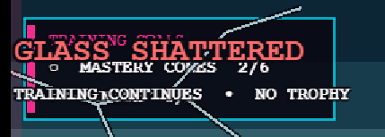
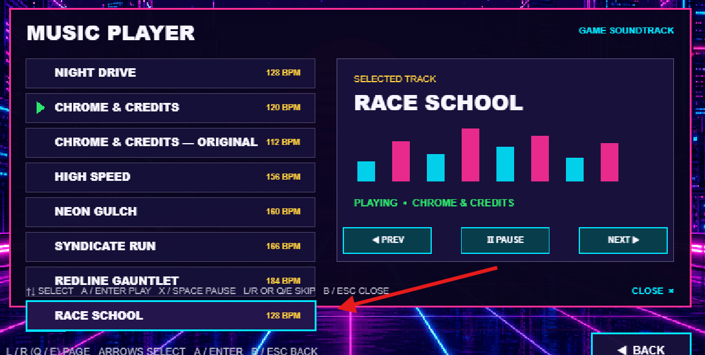
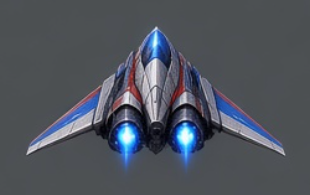

# Things to fix

- [x] When exiting garage pit needs to go back to choose a course not title screen.
- [x] You can buy more than 1 booster to start race with, so I can start with 1 or 3 if I purchase them.  Note that 4th booster will always be empty if you purchase that.  You will need to pick up the forth booster on the track.
- [x] Cone school placement of the cones is not consistent with a slowdown airbreak curve, so getting all those cones in 1 shot is almost impossible.  Can we check the math on the placement so that it can be done 1 shot if you are skilled enough?
  - The late-apex cone moved 0.03 road-width; a driving regression now collects the complete 16-cone finish line in one continuous airbrake hold.
- [x] Hazard Weave has too much text explaining the rocks and damage system.  Can we simplify the messaging to show crack are bad?  Rocks cause cracks?
- [x] Endless needs to transition between levels like the story mode.  So Proving Ground transitions into Neon Gulch transitions into Syndicate Run and these transitions will represent level increases so the game needs to become progressively harder as we go through each transition.
  - Levels change at 6,500m and 13,500m; course generation pressure rises continuously within and between them.
- [x] Endless mode tricks will slightly heal your car from damage which will encourage people to go for those boosts
  - Each earned trick repairs up to 3 hull, capped by the damage actually present.
- [x] Boost pad trick starts with 3 consecutive boost pads being hit, but we add more and more visual specitcle as we continue to hit consecutive boost pads, so the trick will expand as long as you keep hitting those boosts.  This is inspired by the Kill Announcer, double kill, multi-kill, ultra kill, monster kill.  So that is the example.
  - The same live chain escalates at 3, 5, 7, 10, and 15 speed lines, then every five beyond 15.
- [x] Title screen music needs to be created.
- [x] Audio queue when navigating the menu with the control pad
  - A short three-band cursor cue is rate-limited so analog/D-pad chatter cannot leave stale sounds queued.
- [x] Add controller rumble support.  Is this supported in Phaser?
  - Yes where the browser/controller exposes a haptic actuator through Phaser; unsupported hardware safely does nothing.
- [x] Syndicate Run rival difficulty, can it be beat even with a perfect run?
  - Yes. The fastest rival projects to about 159s; a perfect speed-line-ceiling route projects to about 151s. The finale keeps an intentional ~8s window and requires about 95% of that ceiling on average.
- [x] Are story timed runs too easy?  Do the math should be easy to pass, but harder to get gold.
  - Clean no-boost simulations run 58.1s / 59.8s / 65.6s. Qualify/Silver/Gold targets are now 78/70/64, 80/72/66, and 88/80/72 seconds, and the earned rank is saved and shown in the course menu/results.
- [x] Night Drive is better than my Chrome & Credits, and you rework the music for Chrome & Credits, but leave the original for me to have the original song in the music player?  In fact update the md files to say that original songs should be available in the music player :)
- [x] Trophy Room needs a graphics overhaul, use image generation where possible to make it more realistic so it can pop and have a wow factor.
- [x] Race school has generic pictures of the courses, can you update those images with visually different pics or designs like what you do for the story mode?
- [x] Transitions between endless segments needs to be more suttle, the switch between locations and audio is too abrupt and interrupts immersion.
  - The skyline and road palette now crossfade for 1.8 seconds while the score ducks and the new theme fades in; the interrupting full-screen level banner was removed.
- [x] Mark off todo list items as you complete them.
- [x] Rocks need some variety.  Especially when placed together look off, having a few variations to place together would be great.
  - Superseded by the later immersion playtest: the generated variants were removed and the clearer original rock art was restored.
- [x] Multiple UI elements share the same screen real estate , remove what is not needed, swap ui elements to make this a temporary ui holder so you can flip between different notifications...
  - Critical glass/hull feedback now temporarily owns the upper-left notification slot, hides the goals card, then yields the slot back. Objective confirmations wait without being lost; cracks remain the persistent condition read. Verified at 800×600 against the reported shattered-glass case.
- [x] Use a music expert agent to evaluate story mode tracks.  Needs balancing and updates to match better production songs we have from Night Drive.  Each track has a style that should be preserved, but looking at proper EQ so my bass doesn't blast my speakers and we can hear the mids and highs or melody better.  Catchy things we can dance to or get stuck in your head.
  - The specialist pass added per-song bass band limiting and bounded voice gains, brought Neon Gulch and Syndicate hooks forward without erasing their future-funk/cyber-metal identities, and authored Proving Ground's hook-driven D-Dorian “Start Signal.” Replaced arrangements retain separate original Music Player entries.
- [x] Race School audio is same between all tracks add slight variations to temp and pitch to make each sound unique but the same.
  - All six lessons remain variations of Open Circuit, with course-specific arrangement fingerprints and subtle bounded changes of at most ±8 BPM and ±4 semitones.
- [x] Proving Ground needs new track so its not the same as the school.
  - Its Story geometry was already more than twice the school lap; it now also has an independent moonlit test-circuit environment and the new “Start Signal” score instead of reusing the school world/music.
- [x] Recheck off things you have completed, the file got overwritten sorry.
  - Re-verified the restored completed entries against their implementation/tests, then rechecked them without replacing your newer notes.
- [x] Music Player graphics need fixing to have scrollable music 
  - The 11-track library now uses a six-row scroll window with keyboard/controller/wheel navigation, a proportional rail and thumb, range count, and contained pointer rows. Its first and final windows were verified at 800×600.
- [x] Rocks are hard to see with the speed the player is going which makes it hard to navigate the maps now.  Make all objects on the map have a directive of being super visible as this is human player feedback that impacts the games fun factor.
  - Resolved without overlay chrome: the original rock silhouette remains readable at racing speed, while cones, ramps, pickups, and speed lines rely on authored shape, color, and road-surface treatment.
- [x] Markers around track items are not standard from a gaming perspective so its distracting and makes the game feel less imersive.  Please do some research and undo those markers for now.  I would prefer the old rocks over the new ones as they didn't need those types of marks as they were easy to see.  Please only accept practices that are found in existing games for how to handle obstacles and pickups on this kind of track.
  - Restored the original `rock.png`, native perspective scale, and marker-free presentation. Removed the colored bases, hazard brackets, generated rock atlas, and forced minimum sizing. The resulting in-world treatment follows the embedded road-pad language used by WipEout and Burnout's principle that track hazards should fit seamlessly into the world; verified in Hazard Weave at 800×600 and 115 speed.
- [ ] The biggest overhaul I need now is the character sprite, which I am including the inspiration for what I think the game needs , this one needs the strictest validation gate/agent to make sure that the perspectives match the current sprite and that we can modify colors for rivals.  The key to making th is work is using the image generation skills to make it look better than a place holder.  So if we can make this visualization or graphics update work with the feel of the game, then we can make the swap.  This is complete when the perspectives match from a tailing perspective, we need both hard and soft turns so we can visualize the air breaks and turning along with the pitch up and down left and right for the ramps and the flight school.  Sprite should be as detailed as we can for the game as the player will be looking at it for all of the gameplay.  Again the idea is that we can use different colors for rivals.
- [ ] Tracks would benefit from a landmark and better scenery as we are racing through them.  Small objects that we drive by give a sense of speed so I want to keep them, but there isn't much to look at from a surroundings perspective.  Can you look at how other games handle filling in the screen real estate with beautify visuals that make the world feel real or immersive?  School track can be minimalistic as we want it to feel like a training course designed for learning.
- [ ] Delete original music from the game and music player, your edits are better and are thematically the same just better balancing.
- [ ] New vehicle design needs shadow under it, just makes the car feel more real.
- [ ] All gold in drive school unlocks car editor.  Really just lets you change color and then there is a place on the bumper to place a graphic which I am thinking we should allow them to place a flag icon there which can show which country the player is from.
- [ ] Trophy room needs a date earned info so it can feel like a steam achievement.
- [ ] Syndicate Run Rival race needs balancing.  I can't keep up with the rivals yet alone take them out.  I love the track design, especially since you are leveraging things learned in the school like air break into a boost pad because a rock is in the way and using the down pitch after a jump so you don't over jump the road.  These are fantastic design choices and makes its really satisfying to move through the course as it requires mastery and flow.  The only issue is I can't catch the rivals and there is not enough boosts to really boost kill the rivals.  I am glad it is hard, but it shouldn't be impossible.  
